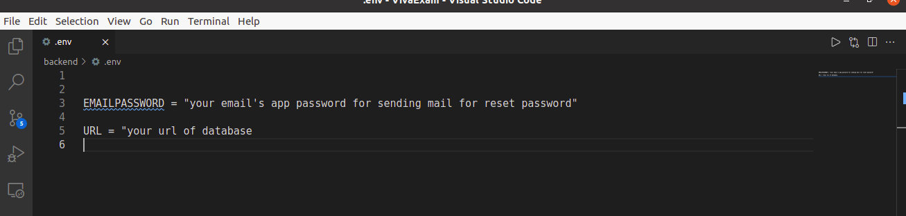

# How to run.
In backend, we use mongodb atlas as database server. At first create a database in your mongodb atlas cluster and paste the database link in .env file. 
For online database connection you can follow this link.
[Connect Backend to Database MongoDB Atlas with NodeJS](https://www.youtube.com/watch?v=68Jd7GXZPe8)

Then you can create an app password by referring to this link.

[How to Create App-Specific Passwords in Gmail](https://www.lifewire.com/get-a-password-to-access-gmail-by-pop-imap-2-1171882)

Then open two terminal one for backend and another for frontend.

In backend path ,run the following commands to start the backend server.

$ **npm install** 
and then 

$ **npm run dev**

In frontend/exam directory, run the following commands to start the frontend server.

$ **npm install**
and then 

$ **npm start** or **ng serve**